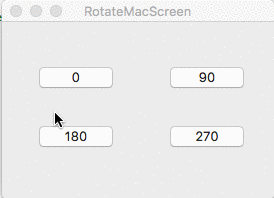

# RotateMacScreen

Mac app written in swift to rotate diaplay screen.
This project demonstrates how to call C function from swift code.

You can rotate screen to 90, 180 and 270 degree orientations.

# Rotate Mac Screen App Usage #


checkout this screencast on [how to Use](http://recordit.co/OQAnSbDPdk)

Interact with C API Example

fileName.swift
```swift
var variableName: Int = 0
cFuncCall(&variableName)

print(variableName)
```
fileName.c
```c
#include <stdio.h>

void cFuncCall(int *variableName) {
    fprintf("%i", variableName);
}
```
input-Bridging-Header.h
```objective-c
void cFuncCall(int *variableName);
```
